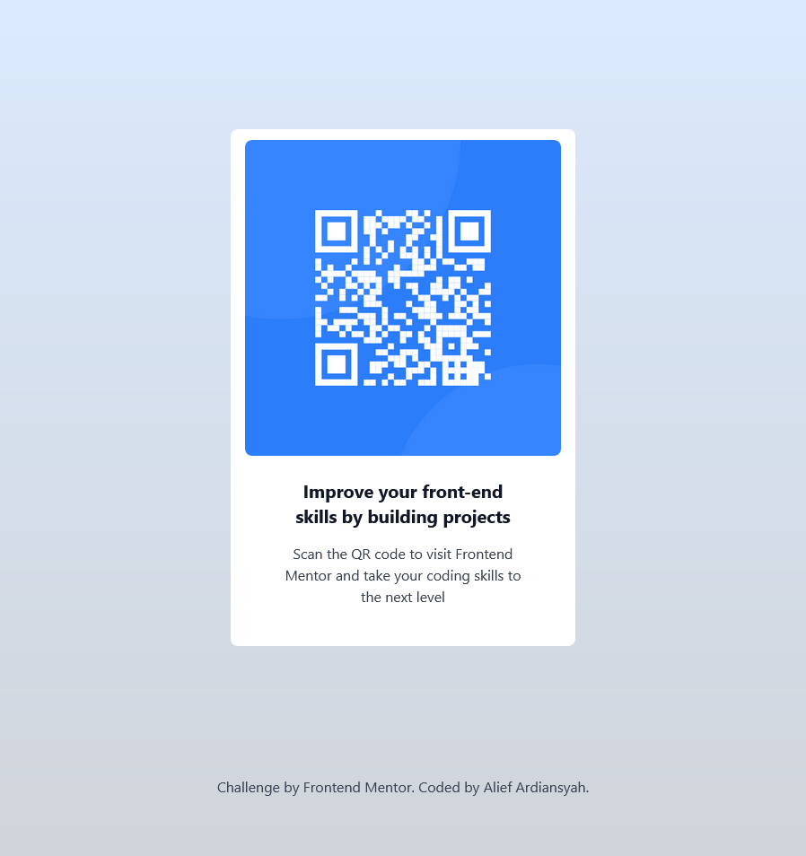

# Frontend Mentor - QR code component solution

This is a solution to the [QR code component challenge on Frontend Mentor](https://www.frontendmentor.io/challenges/qr-code-component-iux_sIO_H). Frontend Mentor challenges help you improve your coding skills by building realistic projects. 

## Table of contents

- [Overview](#overview)
  - [Screenshot](#screenshot)
  - [Links](#links)
- [My process](#my-process)
  - [Built with](#built-with)
  - [What I learned](#what-i-learned)
  - [Continued development](#continued-development)
  - [Useful resources](#useful-resources)
- [Author](#author)
- [Acknowledgments](#acknowledgments)

## Overview

### Screenshot

I use the screenshot feature in Firefox by right-clicking on the screen and selecting Screenshot.

### Links

- Solution URL:(https://github.com/kaptenEscanor/qr-code-main-Frontend-Mentor)
- Live Site URL:(https://qr-code-main-frontend-mentor.vercel.app/)

## My process

### Built with

- Semantic HTML5 markup
- CSS custom properties
- Flexbox
- CSS Grid
- [Tailwindcss](https://tailwindcss.com/) - CSS Framewrok

### What I learned
The lesson I learned while creating qr-code-main in frontend mentor is how to manage CSS and HTML elements such as flexbox, padding, and padding, as well as how to import CSS. 

### Continued development

This is the first I learned in Frontend Mentor. I hope I can make another layout with the help of Frontend Mentor.

## Author

- Alief Ardiansyah
<!-- - Frontend Mentor - [@yourusername](https://www.frontendmentor.io/profile/yourusername)
- Twitter - [@yourusername](https://www.twitter.com/yourusername) -->

